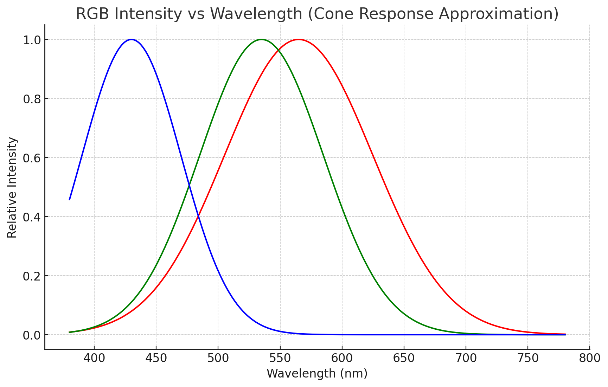
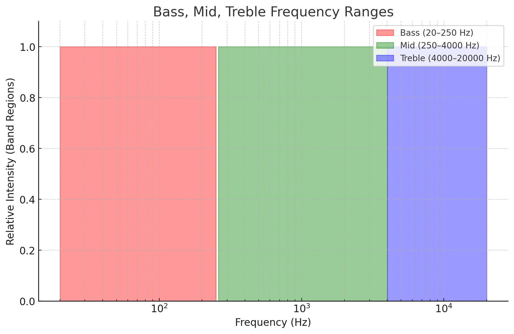

# LightWAV – Colour Your Sound


LightWAV is a full-stack app that maps sound to RGB colour values. This repository is the backend API.

## Official frontends

[](https://github.com/emrothenberg/lightwav-next)

[](https://github.com/emrothenberg/lightwav-electron)

## Formula

### Base logic

Visible light can be represented by three base colours, determined by wavelength: red, green, and blue.



Similarly, sound is divided into three frequency bands: bass (\~20–250 Hz), mid (\~250–4000 Hz), and treble (\~4000–20000 Hz).



* Bass → lowest frequency, longest wavelength → **Red**
* Mid → middle frequencies → **Green**
* Treble → highest frequency, shortest wavelength → **Blue**

### Normalisation

Two issues arise with the base formula:

1. **Flickering:** Audio flickers faster than the eye can perceive.

   * **Fix:** Average colour per frame.
2. **Colour bias:** Most audio doesn’t span the full spectrum, so output tends to a single colour.

   * **Fix:** Normalise per piece (bass = lowest third, mid = middle third, treble = top third).

## Getting started

```bash
# clone + enter
git clone https://github.com/emrothenberg/lightwav-backend.git
cd lightwav-backend

# (optional) venv
python -m venv .venv && . .venv/bin/activate        # Windows: .venv\Scripts\activate

# install
pip install -r requirements.txt

# run (choose one)
python __main__                                   # default entrypoint
# or
uvicorn app.main:app --host 0.0.0.0 --port 8000

# open API
# http://localhost:8000
```

## Installation (requirements)

* Python 3.10+
* FFmpeg in PATH
* `pip install -r requirements.txt`
* (Windows packaging) PyInstaller toolchain

Optional environment variables (set before running):

```
PORT=8000
HOST=0.0.0.0
CORS_ORIGIN=http://localhost:3000
DATA_ROOT=~/LightWAV
```

## Building for packaging

**Linux / macOS**

```bash
chmod +x build.sh
./build.sh
```

**Windows**

```bat
build.bat
```

## API

**Base URL:** `http://localhost:8000`

**Endpoints (core):**

| Method | Path              | Purpose                 |
| -----: | ----------------- | ----------------------- |
|   POST | `/process`        | Upload audio, start job |
|    GET | `/check-progress` | Poll job progress       |
|    GET | `/get-video`      | Download rendered MP4   |
|    GET | `/get-image`      | Download generated PNG  |

**Contracts (concise):**

* **POST `/process`**

  * Form field: `audio_file` (`audio/wav` or `audio/mpeg`).
  * Returns: JSON with `job_id`.
* **GET `/check-progress?job_id=…`**

  * Returns: last progress line; when done returns `100%: Done`.
* **GET `/get-video?job_id=…`** / **`/get-image?job_id=…`**

  * Streams file; 404 until ready.

**cURL:**

```bash
# start
curl -F "audio_file=@song.mp3;type=audio/mpeg" http://localhost:8000/process

# poll
curl "http://localhost:8000/check-progress?job_id=<ID>"

# fetch results
curl -L -o out.mp4 "http://localhost:8000/get-video?job_id=<ID>"
curl -L -o out.png "http://localhost:8000/get-image?job_id=<ID>"
```

## Configuration

| Var           | Default                 | Notes                                         |
| ------------- | ----------------------- | --------------------------------------------- |
| `HOST`        | `0.0.0.0`               | Bind address                                  |
| `PORT`        | `8000`                  | API port                                      |
| `CORS_ORIGIN` | `http://localhost:3000` | Frontend origin                               |
| `DATA_ROOT`   | `~/LightWAV`            | Working dirs (`in_progress/`, `wav/`, `out/`) |

## Notes & tips

* **FFmpeg** must be available in `PATH`.
* Large files: prefer WAV or high-bitrate MP3 for cleaner colour mapping.
* Frontends:
  * Next.js (server): linked above.
  * Electron (local): linked above.
* Change CORS/port via env before packaging or Docker build.

> Notes
>
> * `build.sh` / `build.bat` wrap PyInstaller spec files to produce a standalone binary in `dist/`. For Electron builds copy this file to `lightwav-electron/usr/bin/`.
> * If your frontend runs on a different origin/port, update `CORS_ORIGIN` (or the FastAPI CORS settings) before packaging.